# atlassian-to-rag 📚→🤖 (work-in-progress!!)

Convert Confluence spaces and pages into RAG-optimized content for AI applications. This tool helps bridge the gap between Confluence documentation and AI by making your content queryable through RAG (Retrieval-Augmented Generation).

## Features ✨

- Extract content from Confluence including:
  - Full space content with all pages
  - Individual page content
  - Page metadata and versions
  - Content hierarchies
- Multiple output formats:
  - CSV for raw data
  - PDF for single pages
  - JSONL for RAG-optimized content
- Clean HTML content
- Process content for RAG compatibility
- Comprehensive error handling and logging
- Progress tracking and detailed reports

## Workflow Overview 🔄


## System Architecture 🏗️


## Processing Steps 🔄

```mermaid
sequenceDiagram
    participant U as User
    participant C as CLI
    participant A as Confluence API
    participant S as Storage
    
    Note over U,S: 1️⃣ Content Extraction
    U->>C: Run extract command
    C->>A: Request content
    A-->>C: Return content
    C->>S: Save raw CSV
    
    Note over U,S: 2️⃣ Content Processing
    U->>C: Run process command
    C->>S: Load raw CSV
    C->>C: Clean content
    C->>S: Save RAG JSONL
```



## Output Structure 📊

```mermaid
graph TD
    subgraph "Output Directory Structure"
        Root(("📁 output/"))
        Data["📂 data/"]
        Logs["📂 logs/"]
        
        Root --> Data
        Root --> Logs
        
        Data --> |Raw Content| RC["📄 space_content.csv"]
        Data --> |Processed| PC["📄 processed_content.jsonl"]
        Data --> |Single Pages| SP["📄 page_123.pdf"]
        
        Logs --> |Extraction| EL["📝 extract_logs.log"]
        Logs --> |Processing| PL["📝 process_logs.log"]
    end
    
    style Root fill:#ffffff,stroke:#000000,stroke-width:4px
    style Data fill:#ffffff,stroke:#000000,stroke-width:2px,pattern:dots
    style Logs fill:#ffffff,stroke:#000000,stroke-width:2px,pattern:grid
```



## Installation 🚀

### Prerequisites
- Python 3.9 or higher
- Poetry package manager

### Using Poetry

1. Clone the repository:
```bash
git clone https://github.com/yourusername/atlassian-to-rag.git
cd atlassian-to-rag
```

2. Install dependencies using Poetry:
```bash
poetry install
```

## Setup 🔧

1. Get your Confluence access token:
   - Log in to Confluence
   - Go to Profile Settings
   - Navigate to Security
   - Generate an API token

2. Set up environment variables:
```bash
# Create a .env file in the project root
touch .env

# Add the following to your .env file:
CONFLUENCE_URL='https://your-domain.atlassian.net'
CONFLUENCE_USERNAME='your-email@domain.com'
CONFLUENCE_API_TOKEN='your-api-token'
```

Or set them directly in your terminal:
```bash
export CONFLUENCE_URL='https://your-domain.atlassian.net'
export CONFLUENCE_USERNAME='your-email@domain.com'
export CONFLUENCE_API_TOKEN='your-api-token'
```

## Usage 💻

### Basic Workflow

1. **Extract a Confluence space**:
```bash
poetry run atlassian-to-rag extract-space SPACENAME
```

2. **Extract a single page**:
```bash
poetry run atlassian-to-rag extract-page PAGE_ID --format pdf
```

3. **Process extracted content to RAG format**:
```bash
poetry run atlassian-to-rag process ./output/data/SPACENAME_content.csv
```

### Additional Options

- Specify output directory:
```bash
poetry run atlassian-to-rag extract-space SPACENAME --output-dir /custom/path
```

- Choose output format:
```bash
poetry run atlassian-to-rag extract-space SPACENAME --format all  # Outputs all formats
poetry run atlassian-to-rag extract-space SPACENAME --format raw  # Only raw CSV
poetry run atlassian-to-rag extract-space SPACENAME --format processed  # Only processed JSONL
```

- Process single pages with attachments and comments:
```bash
poetry run atlassian-to-rag extract-page PAGE_ID --include-attachments --include-comments
```

### Output Format 📄

The tool generates JSONL files with RAG-optimized content:

```json
{
  "content": "Clean text content without HTML markup",
  "metadata": {
    "id": "page_id",
    "title": "Page Title",
    "url": "https://confluence-url/pages/page-id",
    "version": "1",
    "last_modified": "2024-01-01T00:00:00.000Z",
    "source": "confluence"
  }
}
```

## Error Handling 🚨

The tool includes comprehensive error handling:
- API authentication issues
- Network connectivity problems
- HTML parsing errors
- Invalid content formats

Errors are logged to:
```
./output/logs/[command]_[timestamp].log
```

## Development 🛠️

### Setup Development Environment

```bash
# Clone repository
git clone https://github.com/yourusername/atlassian-to-rag.git
cd atlassian-to-rag

# Install dependencies with dev packages
poetry install --with dev

# Install pre-commit hooks
poetry run pre-commit install

# Run tests
poetry run pytest

# Run linting
poetry run flake8
poetry run black .
poetry run mypy .
```

## Contributing 🤝

1. Fork the repository
2. Create your feature branch (`git checkout -b feature/AmazingFeature`)
3. Commit your changes (`git commit -m 'Add some AmazingFeature'`)
4. Push to the branch (`git push origin feature/AmazingFeature`)
5. Open a Pull Request

## Troubleshooting 🔍

### Common Issues

1. **Module Not Found Error**
   - Make sure you're using the correct command format:
   ```bash
   poetry run atlassian-to-rag [command]
   ```
   - Not:
   ```bash
   python -m atlassian_to_rag [command]  # This won't work
   ```

2. **"No access token provided"**
   - Check your environment variables are set correctly
   - Verify your .env file is in the correct location
   - Try setting the token directly:
   ```bash
   export CONFLUENCE_API_TOKEN='your_token_here'
   ```

3. **Connection Issues**
   - Check your Confluence URL is correct
   - Verify your API token has correct permissions
   - Ensure you have network access to Confluence

4. **HTML Processing Issues**
   - Try extracting a single page first to verify content
   - Check if the page contains complex macros or embeds

## License 📝

This project is licensed under the Apache License 2.0 - see the [LICENSE](LICENSE) file for details.

## Support 💬

- 📫 For bugs and feature requests, please [open an issue](https://github.com/yourusername/atlassian-to-rag/issues)
- 💡 For questions and discussions, please use [GitHub Discussions](https://github.com/yourusername/atlassian-to-rag/discussions)

## Acknowledgments 🙏

- Atlassian Confluence API Documentation
- The open-source community
- BeautifulSoup4 for HTML processing
